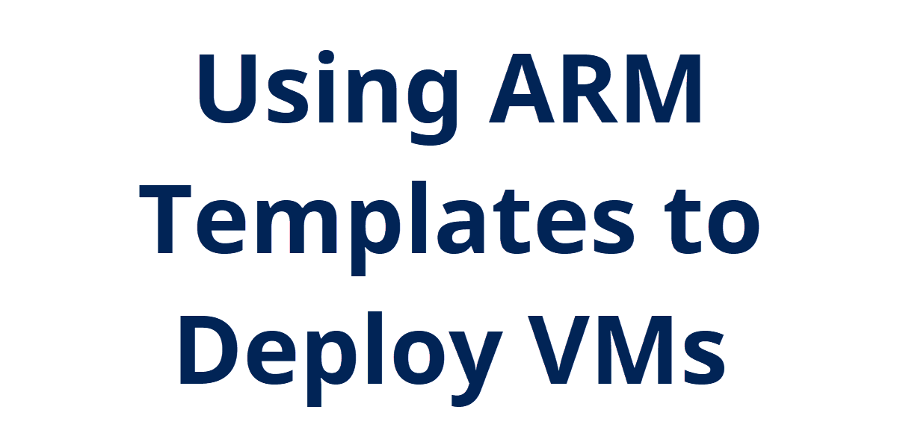
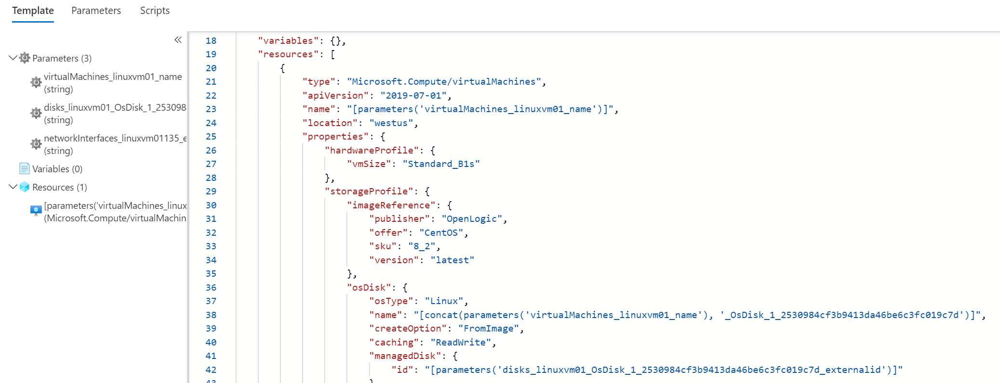
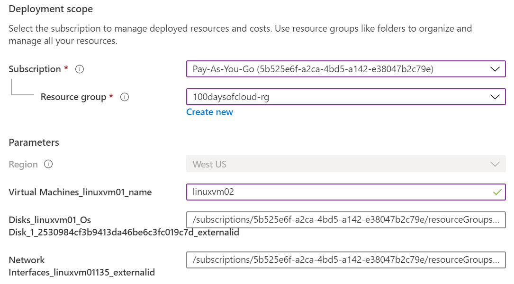
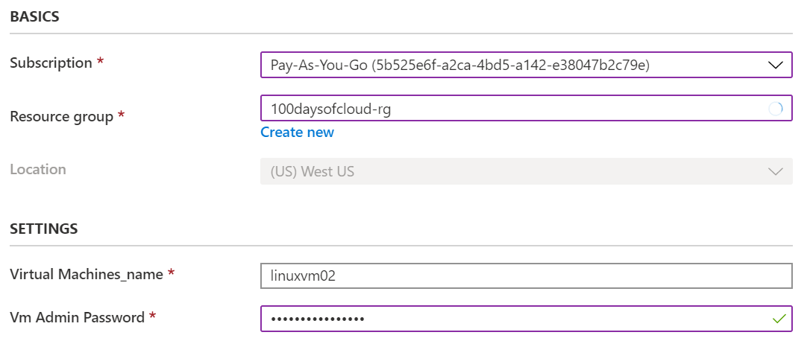

**Add a cover photo like:**

## Introduction

Yesterday I walked through creating a virtual machine in Azure. However, manually going through the portal is probably OK for a one-off resource, but I want an easier way to deploy this virtual machine quickly. Enter Azure Resource Manager or ARM templates.

## Prerequisite

Need an Azure subscription and an example resource to export the ARM template.

## Instructions
Let's go back and look at the VM deployed yesterday. On the right menu under **Settings** there is an **Export template** option. This will bring up a long JSON formatted file that defines the current resource, in this case a virtual machine.

The main thing I want to focus on is the **resources** section. In here we are defining what resources (virtual machine size, disk, operating system, etc.) that we want to deploy. This template file is specific to this resource, so we see references to the size, image or operating system, and admin user name. This all matches what we used yesterday when we created the VM in the portal using the wizard.

Let's click the download button and save the template (mine will be saved in the [*linuxvm01-exported-template folder*](./linuxvm01-exported-template)). It will have two JSON files:
- template.json : this is what we were just viewing in the portal; it has the VM resource definitions
- parameters.json : this contains parameter information that we can pass to the template.json file

So let's go through trying to deploy this template back into Azure. Back on the Azure portal home page, click on **Create a resource** and search for *Template deployment*, select the matching result, and click **Create**.

In the **Select a template** menu, click on *Build your own template in the editor*. In the **Edit template** window, click on **Load file** and navigate to the template.json file we just downloaded. After selecting the file and loading the JSON code, click on Save.

Now we're taken to a familiar screen. It looks a lot like the one from yesterday when building the VM manually. Except there are fewer options to configure. This is because most of the configuration is already defined in the template.json file.

From here, let's select the subscription, resource group, and rename the VM to **LinuxVM02**.

After this, click on **Review + create**, verify validation, and click **Create**.

More than likely this is going to fail. I got an error about the osDisk.managedDisk.id parameter not being allowed. This is probably due to trying to reuse names and ids that are already in place on the original VM. So I need to clean up my template.json file a bit. I'm not going to go through everything I did, but [here is the template.json file I eventually used to deploy a new VM](./linuxvm-generalized-template/template.json).

I removed the managed disk, had to create the NIC prior to creating the VM, had to remove *"requireGuestProvisionSignal": true* (apparently this is not supposed to be exported [according to this GitHub issue](https://github.com/Azure/azure-cli/issues/12775)), and add a parameter for the VM password. Here are now the few portal options to fill out when deploying this template:

It was good to get back into looking at ARM templates, haven't done it in awhile. Had to refer back to some other ones I had built in the past.

## Next Steps

While I reduced the amount of time to deploy in the portal, it'll probably be faster to deploy from PowerShell or CLI. Let's explore that next time.

## Social Proof

[link](link)
