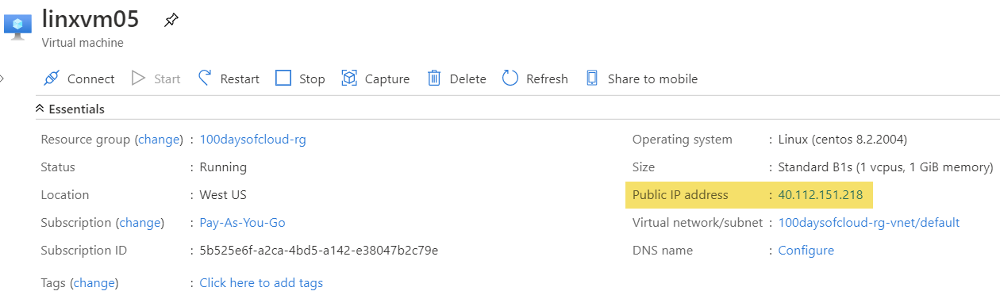
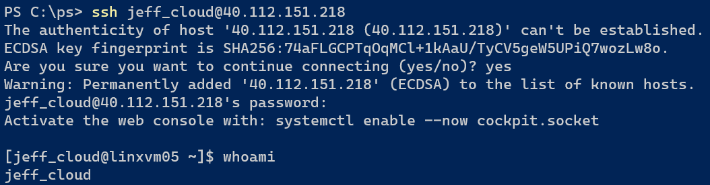

## Introduction

Going to add a public IP address for my Linux virtual machine and a network security group to allow SSH over port 22 so I can remote log into it. Also going to clean up parameters.

## Prerequisite

Azure subscription and the template.json from Day 002 to modify.

## Instructions

So I'm going to add some additional resources to my template.json file to the necessary components so I can log into the VM from the Internet.

Let's start with the public IP address. I created a variable back at the top of the file for 'linuxPublicIp' to name it. I also set the SKU to Basic and used a dynamic IP address. The dynamic is cheaper since it does not have to keep the same IP address when the virtual machine is turned off/deallocated. Here is the JSON I finished with to create it:

```json
{
    "name": "[variables('linuxPublicIp')]",
    "type": "Microsoft.Network/publicIPAddresses",
    "apiVersion": "2019-07-01",
    "location": "[resourceGroup().location]",
    "sku": {
        "name": "Basic"
    },
    "properties": {
        "publicIPAllocationMethod": "Dynamic"
    }
}
```

Next I need the network security group (NSG) to allow SSH over port 22. This comes into two parts: one for the security group and one for the security rule. However, I'm not entirely sure the purpose of defining the security rule in the networkSecurityGroups and networkSecurityRule. I wonder because the first time I tried this I did a bad copy/paste job and the name and priority for the rule did not match what was in the "securityRules" in the networkSecurityGroups. It ended up creating two separate rules in the final NSG. So something I need to explore further.

One thing I want to note is the "dependsOn" in the securityRules resources. This is to make sure the Azure Resource Manager service doesn't try to create the securityRules resource before the networkSecurityGroups resources is done. Just because a resource is higher in the template.json file doesn't mean it will get created first, so you can create dependencies to make sure things are made in order.

```json
{
    "name": "[variables('linuxNsg')]",
    "type": "Microsoft.Network/networkSecurityGroups",
    "apiVersion": "2019-07-01",
    "location": "[resourceGroup().location]",
    "properties": {
        "securityRules": [
            {
                "name": "Allow_SSH",
                "properties": {
                    "protocol": "Tcp",
                    "sourcePortRange": "*",
                    "destinationPortRange": "22",
                    "sourceAddressPrefix": "*",
                    "destinationAddressPrefix": "*",
                    "access": "Allow",
                    "priority": 200,
                    "direction": "Inbound",
                    "sourcePortRanges": [],
                    "destinationPortRanges": [],
                    "sourceAddressPrefixes": [],
                    "destinationAddressPrefixes": []
                }
            }
        ]
    }
}

{
    "type": "Microsoft.Network/networkSecurityGroups/securityRules",
    "apiVersion": "2019-07-01",
    "name": "[concat(variables('linuxNsg'), '/Allow_SSH')]",
    "dependsOn": [
        "[resourceId('Microsoft.Network/networkSecurityGroups', variables('linuxNsg'))]"
    ],
    "properties": {
        "protocol": "TCP",
        "sourcePortRange": "*",
        "destinationPortRange": "22",
        "sourceAddressPrefix": "*",
        "destinationAddressPrefix": "*",
        "access": "Allow",
        "priority": 200,
        "direction": "Inbound",
        "sourcePortRanges": [],
        "destinationPortRanges": [],
        "sourceAddressPrefixes": [],
        "destinationAddressPrefixes": []
    }
}
```

Finally, I updated the networkInterface resource with the "publicIPAddress" property and the "networkSecurityGroup" property. Note the additional use of the dependsOn properties. We don't want to create the networkInterface until the public IP address and the NSG is created as we need these resources prior to making the networkInterface.

```json
{
    "name": "[variables('linuxNic')]",
    "type": "Microsoft.Network/networkInterfaces",
    "apiVersion": "2019-07-01",
    "location": "[resourceGroup().location]",
    "dependsOn": [
        "[resourceId('Microsoft.Network/publicIPAddresses', variables('linuxPublicIp'))]",
        "[resourceId('Microsoft.Network/networkSecurityGroups', variables('linuxNsg'))]"                
    ],
    "properties": {
        "ipConfigurations": [
            {
                "name": "ipconfig1",
                "properties": {
                    "subnet": {
                        "id": "[variables('subnetRef')]"
                    },
                    "privateIPAllocationMethod": "Dynamic",
                    "publicIPAddress": {
                        "id": "[resourceId('Microsoft.Network/publicIPAddresses', variables('linuxPublicIp'))]"
                    },
                    "primary": true,
                    "privateIPAddressVersion": "IPv4"
                }
            }
        ],

        "networkSecurityGroup": {
            "id": "[resourceId('Microsoft.Network/networkSecurityGroups', variables('linuxNsg'))]"
        }
    }
}
```

Finally, I cleaned up the parameter names a bit and added Administrator as a parameter so it wasn't hardcoded on the VM.
The deployment worked great, here's the overview information for the VM, note the public IP address:



Jumping out to PowerShell, I'll use the OpenSSH client now included in Windows 10 to connect to the Linux VM using the Adminstrator name, Password, and public IP address:



## Next Steps

Next I want to add the virtual network and subnet as parameters so they are not hardcoded as well.

## Social Proof

[Twitter](link)
[LinkedIn](link)
