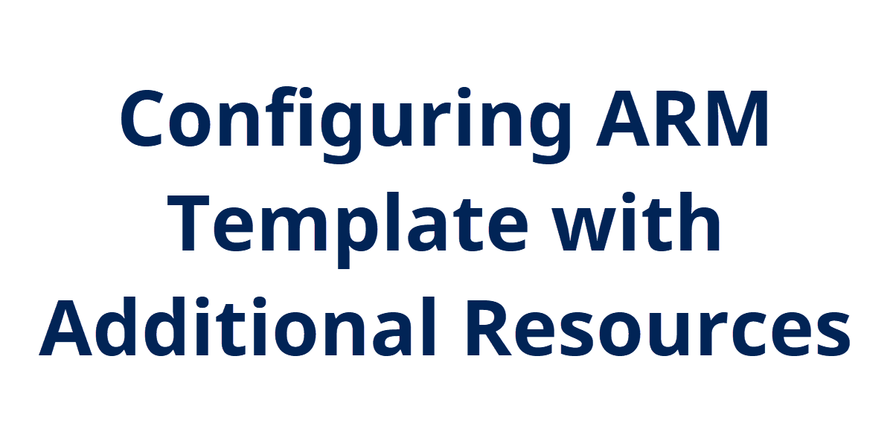

## Introduction

Still working on configuring an ARM template to deploy a complete lab environment with a Linux VM. Need to add the creation of a virtual network and subnet in it.

## Instructions

Going to keep it short and simple today. I added some variables to set the address space for the entire virtual network, then the IP address range for a subnet inside that vnet. From there I created a virtual network with a single subnet in it:

```json
{
            "type": "Microsoft.Network/virtualNetworks",
            "apiVersion": "2020-05-01",
            "name": "[variables('vnetName')]",
            "location": "[resourceGroup().location]",
            "properties": {
                "addressSpace": {
                    "addressPrefixes": [
                        "[variables('vnetAddressSpace')]"
                    ]
                },
                "subnets": [
                    {
                        "name": "[variables('subnetName')]",
                        "properties": {
                            "addressPrefix": "[variables('subnetAddressSpace')]"
                        }
                    }
                ],
                "virtualNetworkPeerings": [],
                "enableDdosProtection": false,
                "enableVmProtection": false
            }
        }
```

I also needed to add another dependsOn object to the virtual machine network interface so it didn't try to create before the virtual network and subnet existed.

## Next Steps

The last thing I want to do is save an admin password into a key vault and have the template use that to set the password on the admin account for the vm.

## Social Proof

[Twitter](link)
[LinkedIn](link)
