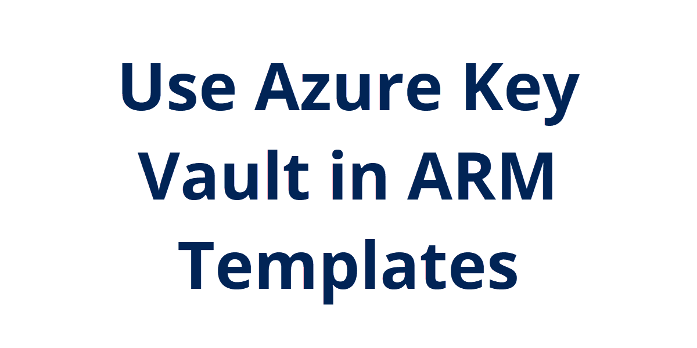

## Introduction

So a few days ago I ran into an issue passing a secure string in PowerShell during a template deployment. So I had to investigate pulling a secret like a password value from Azure Key Vault from the template.

## Use Case

Azure Key Vault can store keys, secrets, and certificates. Access policies can be set to limit who can access the key vault as well as what actions.

## Instructions

I followed this tutorial ([Integrate Azure Key Vault in your ARM template deployment](https://docs.microsoft.com/en-us/azure/azure-resource-manager/templates/template-tutorial-use-key-vault)) to understand the syntax. I had to bring back the [parameters.json](./linvm-generalized-template/parameters.json) file. Using a parameters file allows for automating values for a deployment for a specific environment.

Referencing the key vault and secret is pretty simple in the parameters file:

```json
"Password": {
    "reference": {
        "keyVault": {
        "id": "/subscriptions/5b525e6f-a2ca-4bd5-a142-e38047b2c79e/resourceGroups/api-keys-rg/providers/Microsoft.KeyVault/vaults/lab-resources"
        },
        "secretName": "LinuxAdmin"
    }
}
```

The thing I didn't like is it also seems I have to specify the other parameters in the file. I wasn't able to pass them as inline parameters when using the parameter template with New-AzResourceGroupDeployment. But otherwise I like this to quickly deploy a Linux virtual machine while studying for the LPI Linux Essentials exam.

I save the template and parameter URI from GitHub to their respective variables and deployed the resources like so:

```powershell
New-AzResourceGroupDeployment -ResourceGroupName "100daysofcloud-rg" -TemplateUri $templateuri -TemplateParameterUri $parameteruri

## Next Steps

I think I am pretty much done with this for now. Next I need to move onto some other topics, most likely Ansible and using it in Azure.

## Social Proof

[Twitter](link)
[LinkedIn](link)
