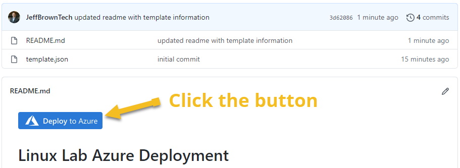
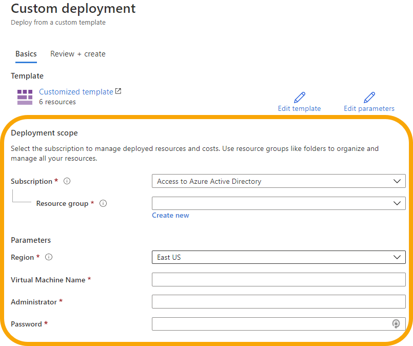

## Introduction

I briefly looked at deploying a template from the Azure portal and from PowerShell. One last option I wanted to add is using a Deploy to Azure button directly from GitHub.

## Prerequisite

A template and GitHub account.

## Try yourself

I followed the instructions found [here in Microsoft Docs for deploying an Azure button](https://docs.microsoft.com/azure/azure-resource-manager/templates/deploy-to-azure-button).
It's pretty straight forward using some PowerShell to encode the URL.

I put the Linux lab template I've been building into its own repo named [linux-lab](https://github.com/JeffBrownTech/linux-lab). Notice the "Deploy to Azure" button. Clicking this takes you straight into the Azure portal and prompts for the basic information, resource group, vm name, admin name, and password.

This can be a bit quicker deployment than loading up PowerShell or manually creating the template deployment resource in Azure.

If I wanted, I guess I could default some of the values but for now I'll keep it generic.

## Next Steps

Need to move onto some Infrastructure as Code concepts with Ansible.

## Social Proof

[Twitter](link)
[LinkedIn](link)
