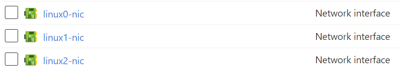

## Introduction

So I thought maybe I was done with ARM templates for now, but I came across an old project while learning something new that brought me back. We're going to look at deploying an Ansible lab using Azure and ARM templates.

## Concepts

So I've decided to dive into Ansible next. This week I watched the first two videos of [Jeff Geerling's YouTube series Ansible 101](https://www.youtube.com/playlist?list=PL2_OBreMn7FqZkvMYt6ATmgC0KAGGJNAN). This is my second start on learning Ansible, and I previously worked in an ARM template that would deploy an Ansible lab - one Ansible control server and a few hosts to push configs out to.

I picked that ARM template back up this week and put it in its own [ansible-lab](https://github.com/JeffBrownTech/ansible-lab) repository. It need some work, namely some network security groups.

I originally had one Linux VM and one Windows VM to use as target systems for Ansible commands. However, I decided I wanted to have multiple Linux VMs in order to work with inventory files and pushing out different configurations. Instead of copy/paste the Linux VM configurations in the ARM template, ARM templates can use the *copy* element for a resource to make multiple copies.

Here's an example of making multiple virtual network interface cards using the copy command. Note the new "copy" property after the "dependsOn" section:

```json
{
    "name": "[concat(variables('linuxVmName'), copyIndex(), '-nic')]",
    "type": "Microsoft.Network/networkInterfaces",
    "apiVersion": "2017-09-01",
    "location": "[resourceGroup().location]",
    "dependsOn": [
        "[resourceId('Microsoft.Network/virtualNetworks', variables('vnetName'))]"
    ],
    "copy": {
        "name": "linuxNicCopy",
        "count": 3
    },
    "properties": {
        "ipConfigurations": [
            {
                "name": "ipconfig1",
                "properties": {
                    "subnet": {
                        "id": "[variables('subnetRef')]"
                    },
                    "privateIPAllocationMethod": "Dynamic"
                }
            }
        ],

        "networkSecurityGroup": {
            "id": "[resourceId('Microsoft.Network/networkSecurityGroups', variables('default-nsg'))]"
        }
    }
}
```

I'm using two properties in the copy element: name and count. I'm not sure the signifance of the **name** property as it is not referenced within the resource. The **count** is just the number of this type of resources I want to deploy, in this case 3.

Now we have to get dynamic with our naming. Instead of a static name for the NIC using a variable, I need to append the name with the current copy index (the copy index starts at 0, like arrays). So in the "name" field, I'm concatenating the linuxVmName variable, the current copy index, and then "-nic" for the resource type. This will yield 3 NICs like this:



I did the same thing for the Linux virtual machine, specify three copies and change the **name** property to concatenate the linuxVmName variable with the current copy index:

```json
{
            "name": "[concat(variables('linuxVmName'), copyIndex())]",
            "type": "Microsoft.Compute/virtualMachines",
            "apiVersion": "2019-03-01",
            "location": "[resourceGroup().location]",
            "dependsOn": [
                "[resourceId('Microsoft.Network/networkInterfaces', concat(variables('linuxVmName'), copyIndex(), '-nic'))]"
            ],
            "copy": {
                "name": "linuxVmCopy",
                "count": 3
            },
            "properties": {
                "hardwareProfile": {
                    "vmSize": "[variables('vmSize')]"
                },

                "storageProfile": {
                    "osDisk": {
                        "createOption": "fromImage",
                        "managedDisk": {
                            "storageAccountType": "[variables('osDiskType')]"
                        },
                        "diskSizeGB": 31
                    },
                    "imageReference": {
                        "publisher": "OpenLogic",
                        "offer": "CentOS",
                        "sku": "7.7",
                        "version": "latest"
                    }
                },

                "networkProfile": {
                    "networkInterfaces": [
                        {
                            "id": "[resourceId('Microsoft.Network/networkInterfaces', concat(variables('linuxVmName'), copyIndex(), '-nic'))]"
                        }
                    ]
                },

                "osProfile": {
                    "computerName": "[concat(variables('linuxVmName'), copyIndex())]",
                    "adminUsername": "[parameters('vmAdminName')]",
                    "adminPassword": "[parameters('vmAdminPassword')]"
                }
            }
        }
```

The tricky part is the "dependsOn" and "networkProfile" sections. These use the NICs created in the previous JSON section. However, when it was just one virtual machine, I had a variable in here representing the NIC name. Now I need to do the same thing when I named the NIC using the copy index: concatenate it together with the linuxVmName variable, the copy index, and "-nic". So as each NIC gets created, then the virtual machine can be created.

```json
"[resourceId('Microsoft.Network/networkInterfaces', concat(variables('linuxVmName'), copyIndex(), '-nic'))]"
```

And how I have three virtual machines with three virtual nics created from a single resource in the ARM template:


## ☁️ Cloud Outcome

Being able to define multiple copies of the same resource is pretty cool. It helps shorten what could be long ARM templates and can standardize naming conventions and ensure each resource is exactly the same.

## Next Steps

Alright, hopefully that's it for ARM templates, coming soon should be some Ansible stuff.

## Social Proof

[Twitter](link)
[LinkedIn](link})