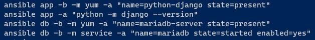

## Introduction

I work through Chapter 3 of Ansible for DevOps and make some improvements on my ansible lab deployment.

## Overview

Before deploying my [Ansible lab](https://github.com/JeffBrownTech/ansible-lab) again, I made a parameters.json file and saved it to my Azure Shell clouddrive so I can reuse it easily. I set variables so I don't have to enter my administrator name, and it pulls a secret for the password from my Azure Key Vault (values in "<>" are obfuscated):

```json
{
    "$schema": "https://schema.management.azure.com/schemas/2015-01-01/deploymentParameters.json#",
    "contentVersion": "1.0.0.0",
    "parameters": {
        "vmAdminName": {
            "value": "admin"
        },

        "vmAdminPassword": {
            "reference": {
                "keyVault": {
                "id": "/subscriptions/<subscription guid>/resourceGroups/api-keys-rg/providers/Microsoft.KeyVault/vaults/lab-resources"
                },
                "secretName": "<secret name>"
            }
        }
    }
}
```

I then saved a one-liner PowerShell command to a script to deploy the lab using the template in my GitHub along with the local file in my Azure shell clouddrive:

```powershell
New-AzResourceGroupDeployment -ResourceGroupName ansible-lab-rg -Mode Complete -TemplateUri "https://raw.githubusercontent.com/JeffBrownTech/ansible-lab/main/deploy-ansible-lab.json" -TemplateParameterFile .\parameters.json
```

Once the lab was deployed, I made a "project" folder and created an *ansible.cfg* file to set some defaults. In this case, I set my inventory file to be just "inventory". This means that I don't need to specify *-i inventory* when running ansible commands. Contents of the ansible.cfg file:

```
[defaults]
inventory = inventory
```

I then create the inventory file itself making two of my Linux servers app servers and then the third as the database server. I can target specific groups of endpoints using *[group name]* and the list of server names or IP addresses.

You can also make groups of groups with the :children suffix, so I have a "multi" group that includes both the app and db groups.

Finally, I created some variables that apply to the multi group (or effectively all servers in the inventory file). I specified the username to connect to the servers as well as the password. Yes, storing a plain text password is not recommended, but for testing/lab purposes, that's what I have for now.

```
[app]
linux0
linux1

[db]
linux2

[multi:children]
app
db

# Variables applied to all servers
[multi:vars]
ansible_user=jeff_cloud
ansible_ssh_pass=< password >
```

Having these variables along with the ansible.cfg file reduces the number of switches I need for the *ansible* command. Here are a couple of examples installing Django to my app servers & verifying the version, and then installing MariaDB to my database server & settings the service to autostart. Notice I no longer need to specify the inventory file, the username, or the password:



I had to use the yum module to Django. The commands from the book to install Django using pip would not work for me and was unable to find an answer quickly. So I pivoted to using the yum module instead.

## ☁️ Cloud Outcome

I worked a bit more to automate the ansible lab deployment and used inventory variables to make the ansible commands easier to execute.

## Next Steps

Going to work through playbooks chapter next and then maybe start looking at using Ansible with Azure resources.

## Social Proof

[Twitter](https://twitter.com/JeffWBrown/status/1304227664887074816?s=20)
[LinkedIn](https://www.linkedin.com/posts/jeffwaynebrown_jeffbrowntech100daysofcloud-activity-6709993550874079233-Yin1)
