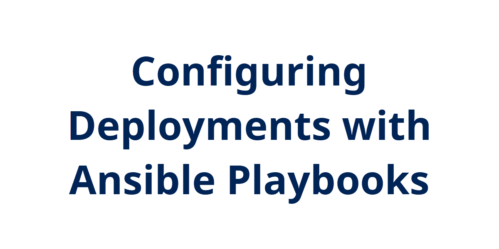
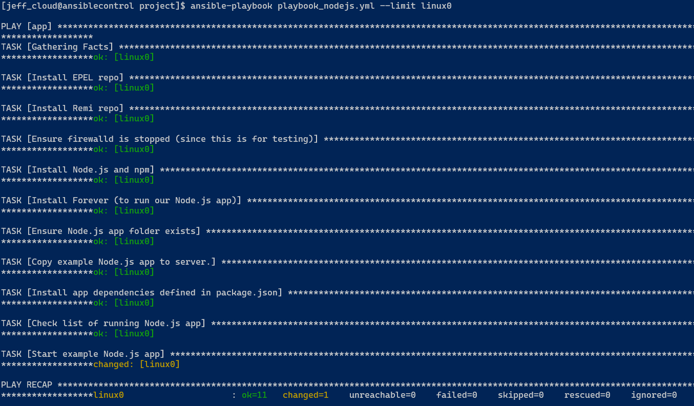
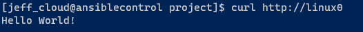
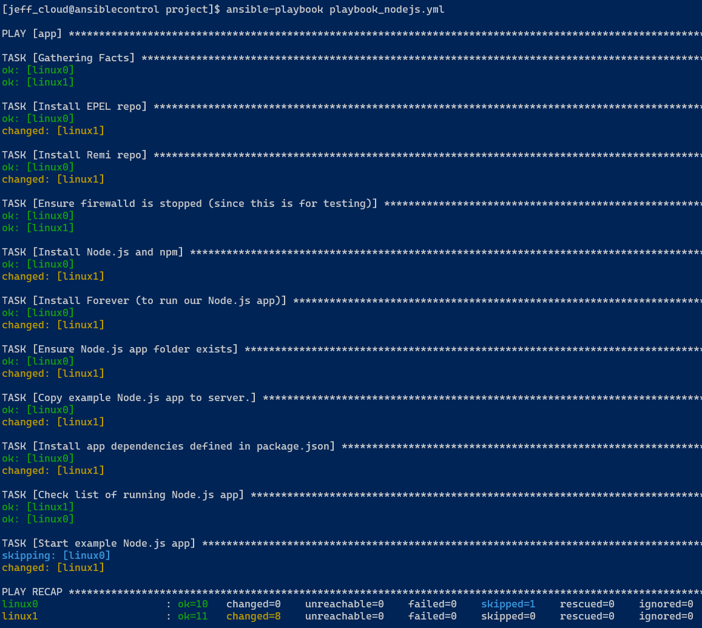

## Introduction

Continuing with Ansible topics with playbooks. This continues with Chapter 4 of the Ansible for DevOps book.

## Theory

Ansible playbooks define server configuration, such as software packages that should be installed or files that should exist. Ansible is written in YAML. It has a simple syntax and reminds me of Python in that it requires specific spacing.

## Try yourself

This example follows the example from the book for deploying nodeJS to a server along with a basic application.

I kept my inventory and config files the same from [Day 10](..\010\README.MD). I created the playbook from the book, also [available here from Jeff's GitHub](https://github.com/geerlingguy/ansible-for-devops/blob/master/nodejs/provisioning/playbook.yml). Minor difference for mine is I targeted the "app" group instead of all hosts.

After a couple of errors (typos on my part), I finally got the playbook to complete correctly. That is why in this screenshot everything else is "green" for "no change" except the last step. I also only targeted linux0 from the app group instead of both servers just to use the command that way.

```bash
$ ansible-playbook playbook_nodejs.yml --limit linux0
```



And then use curl to verify the app is up and running and returns "Hello World!":



I then removed the --limit and let it run against all serves in the app group:



While I understand how powerful Ansible is with its idempotence, running through this exercise really cemented it. The first time I ran the playbook, it had a few errors due to my typos. But I knew I could run the playbook again and not worry that an ealier configuration would de-rail the whole thing.

And once I had one host configured, it didn't matter that I ran it again and included another server from the group. It checks the first server and sees it is fully configured and doesn't make any changes.

## Next Steps

Continue working through the exmaple playbooks from Chapter 4 just to get familiar with playbook syntax and configuration. Soon I'll look at how to deploy Azure resources with Ansible.

## Social Proof

[Twitter](https://twitter.com/JeffWBrown/status/1304610987580899328?s=20)
[LinkedIn](lihttps://www.linkedin.com/posts/jeffwaynebrown_jeffbrowntech100daysofcloud-activity-6710376845721796608-wnCSnk)
