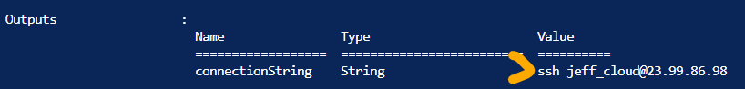

## Introduction

Alright, thought I was done going over ARM templates, but I had one last idea that I couldn't help myself adding. I wanted to add an output once the ARM template completed for my [ansible-lab](https://github.com/jeffbrowntech/ansible-lab) that outputed the ssh connection string to connect to the public ip address of the ansiblecontrol server.

## Use Case

After an ARM template deployment is done, you may want some outputs or information from the deployed resources or with a linked template. 

## Try yourself

After defining all the resources in the ARM template, add an *outputs* section. I named this output "connectionString" and concatenated the ssh and @ symbols while extracting the value of the vmAdminName parameter and the ipAddress of the publicIPAddress resource:

```json
"outputs": {
    "connectionString": {
        "type": "string",
        "value": "[concat('ssh ', parameters('vmAdminName'), '@', reference(resourceId('Microsoft.Network/publicIPAddresses', variables('ansiblePIP'))).ipAddress)]"
    }
}
```

## ☁️ Cloud Outcome

After the ARM template is completed, I can now just copy the connectionString output and use it to connect to the virtual machine:



## Social Proof

[Twitter](https://twitter.com/JeffWBrown/status/1306075763460857856?s=20)
[LinkedIn](https://www.linkedin.com/posts/jeffwaynebrown_jeffbrowntech100daysofcloud-activity-6711841607169273857-_Vnm)
