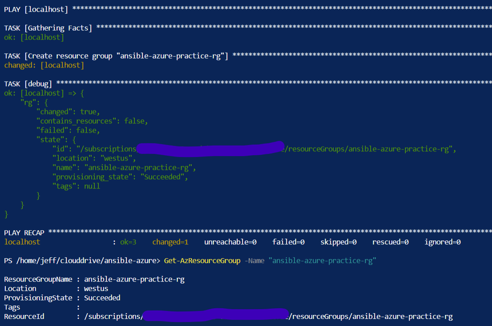
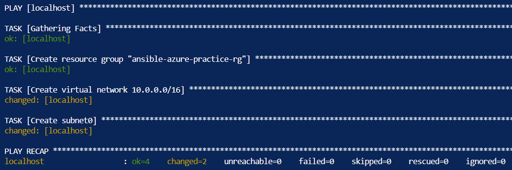

## Introduction

I'm going to continue studying Ansible using the resources from Jeff Geerling's book and YouTube series, but I have a decent understanding now that I feel comfortable trying to deploy some Azure resources.

## Prerequisite

The Azure Cloud Shell has the ability to run Ansible commands and playbooks with additional configuration. If you don't have your Cloud Shell configured yet, check out [Day 003](https://github.com/JeffBrownTech/100DaysOfCloud/blob/main/Journey/003/Readme.md) where I discussed how to configure the storage account and file share required.

The Cloud Shell takes up minimal resources and will probably cost less than $1 a month. I typically don't store any files in it, but I'm starting to leave some scripts and other artifacts in the file share, so I'm curious how much additional charge this will be. These are small files, so I suspect not a lot.

## Use Case

Instead of ARM templates written in JSON, Ansible has simpler syntax using YAML. Ansible also has the ability to configure settings within virtual machines using modules, which I don't believe ARM templates can do natively without running scripts or DSC templates.

## Instructions

An initial search for Ansible and Azure modules brought me to [this quickstart page using Ansible and Azure Cloud Shell](https://docs.microsoft.com/en-us/azure/developer/ansible/getting-started-cloud-shell?tabs=ansible). It's pretty simple to get started, so I followed the example and create a playbook to create a resource group (which I also think is something ARM templates can't do either):

```yml
---
- hosts: localhost
  connection: local
  tasks:
    - name: Create resource group "ansible-azure-practice-rg"
      azure_rm_resourcegroup:
        name: "ansible-azure-practice-rg"
        location: "westus"
      register: rg
    - debug:
        var: rg
```

I went ahead and hard-coded the values and didn't use variables yet, but maybe next time. The result, a resource group was deployed successfully:



Running the playbook again will result in no changes (cause of the idempotence!). While initially learning Ansible, I had wondered what I would use for hosts when deploying the Azure resources. So far it looks like you deploy using "localhost" but I will need to research more on this or see if I come across a different example.

So I want to rebuild my [ansible-lab](https://github.com/jeffbrowntech/ansible-lab) ARM template using Ansible. After the resource group, the next thing I need is a virtual network and a subnet.

```yml
- name: Create virtual network 10.0.0.0/16
    azure_rm_virtualnetwork:
    name: vnet-10-0-0-0
    resource_group: ansible-azure-practice-rg
    state: present
    address_prefixes_cidr:
        - "10.0.0.0/16"

- name: Create subnet0
    azure_rm_subnet:
    name: subnet0
    resource_group: ansible-azure-practice-rg
    virtual_network_name: vnet-10-0-0-0
    state: present
    address_prefix_cidr: "10.0.0.0/24"
```

The result, a new virtual network and subnet to go along with it:



I'm already liking the syntax simplicity of YAML compare to the JSON in ARM templates.

## ☁️ Cloud Outcome

Ability to create Azure resources with Ansible playbooks.

## Next Steps

I will continue to build out this playbook to create an Ansible lab, such as network security groups, virtual NICs, and public IP address. Then will get into building out virtual machines. Also need to go ahead and build out a variables file instead of hard-coding a lot of this to make it more generalized.

## Social Proof

[Twitter](link)
[LinkedIn](link)
