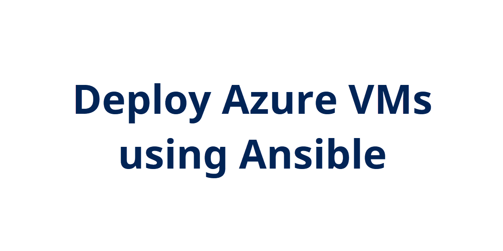

## Introduction

Continuing on replicating my Ansible lab I originally built using ARM templates.

## Try yourself

Just like with ARM templates, I need to build the network interface for the VM first. Pretty straight forward with specifying the NIC name, resource group, virtual network, and subnet. Then configuring the IP configuration. For the NIC for the ansible server, I put a public IP address on it. One difference with Ansible is I don't have to create the public IP resource first, I can specify it directly in the NIC IP configuration. Finally, assigning a security group that is created priot in the playbook:

```yml
- name: Create {{ ansiblecontrol_vm_name }} network interface
    azure_rm_networkinterface:
    name: "{{ ansiblecontrol_vm_name }}-nic"
    resource_group: "{{ rg_name }}"
    virtual_network: "{{ vnet_name }}"
    subnet_name: "{{ subnet0_name }}"
    state: present
    ip_configurations:
        - name: "ipconfig1"
        private_ip_allocation_method: Dynamic
        public_ip_address_name: "{{ ansiblecontrol_vm_name }}-publicip"
        public_ip_allocation_method: Dynamic
    security_group: "{{ ansiblecontrol_vm_name }}-nsg"
```

Onto creating the virtual machine. Also pretty straight forward in setting the admin username and password, the VM size, the previously created NIC interface, and the image to use.

```yml
- name: Create ansible virtual machine
    azure_rm_virtualmachine:
    resource_group: "{{ rg_name }}"
    name: "{{ ansiblecontrol_vm_name }}"
    vm_size: "{{ vm_size }}"
    admin_username: "{{ admin_username }}"
    admin_password: "{{ admin_password }}"
    network_interfaces: "{{ ansiblecontrol_vm_name }}-nic"
    managed_disk_type: Standard_LRS
    os_disk_name: "{{ ansiblecontrol_vm_name }}_os-disk"
    image:
        offer: CentOS
        publisher: OpenLogic
        sku: "{{ centos_sku }}"
        version: latest
```

The full playbook with variable file can be found this repo: [azure-ansible-lab](https://github.com/JeffBrownTech/azure-ansible-lab)

## ☁️ Cloud Outcome

Ability to deploy Azure resources using Ansible.

## Next Steps

Think I need to move onto a different topic like Azure Functions or Azure Automation.

## Social Proof

[Twitter](https://twitter.com/JeffWBrown/status/1314410857988726786?s=20)
[LinkedIn](https://www.linkedin.com/posts/jeffwaynebrown_jeffbrowntech100daysofcloud-activity-6720176663495348224-iFmR)
