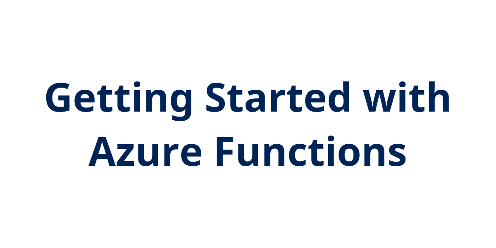
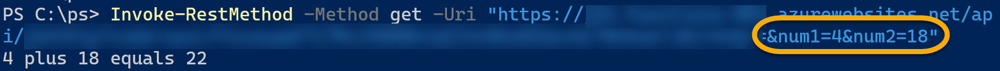

## Introduction

Moving on from working on deploying infrastructure, I'm going to start exploring other functionality inside of Azure, starting with Azure Functions.

Azure Functions are considered "serverless", meaning you can run application or code without worrying about the underlying server infrastructure. The code is still running on a server but you don't have to worry about managing that server with updates or configuration.

Azure Functions support several languages like C#, Java, JavaScript, Python, and PowerShell. I'm going to be focusing on using PowerShell.

## Learning Resources

I'm starting this journey by watching Matt Allford's ([@mattallford](https://twitter.com/mattallford)) CloudSkill's course [Azure Functions for DevOps Engineers](https://portal.cloudskills.io/azure-functions-powershell). Have only finished the first two modules on getting started but it's looking like a great course.

Otherwise, head over to [Microsoft Docs](https://docs.microsoft.com/en-us/azure/azure-functions/functions-overview) to start learning.

## Prerequisite

An Azure subscription and some PowerShell knowledge.

## Use Case

So Azure Functions allow for running small pieces of code to accomplish a task. Matt gives some examples such as removing a VM from a monitoring solution when it is deleted or sending an email when certificates are about to expire.

## Try yourself

When learning Azure Functions, it seems the first example to try is an HTTP trigger. This allows for making a call against an URI and getting a response. This is pretty much like working with an API. I'm not going to cover how to create your first function but [here is a good guide from Microsoft Docs to get started](https://docs.microsoft.com/en-us/azure/azure-functions/functions-create-first-azure-function).

Once the HTTP trigger function is created, it'll have some standard example code to get you started. For PowerShell, it's a simple script that take in name either via the query or in the body of the HTTP request and displays a message.

I wanted to play with this a bit more and decided to pass in two numbers, have the function add them together, then display the result.

```powershell
[int]$num1 = $Request.Query.Num1
[int]$num2 = $Request.Query.Num2
[int]$sum = $num1 + $num2

$body = "$num1 plus $num2 equals $sum"
```

The $Request variable is the incoming request data when the function is triggered by an HTTP request. The Query property is the additional information passed in the HTTP query, then the different parts including num1 and num2. So for example, at the end of the URI used to trigger the function, I can append the values I want to pass for num1 and num2 using *&num1=7* and *&num2=13*:

```
https://<function name>.azurewebsites.net/api/<http trigger name>?code=<function key>&num1=7&num2=13
```

When pasting into a browser, it will display my $body string that shows the two numbers and their sum:


I can also call this function programmatically, so here's an example using Invoke-RestMethod in PowerShell:



Apologies if hard to see in these screenshots but I'm blurring out the function app name and the key, but hopefully this helps.

## Next Steps

Going to continue with Matt's course and get into developing functions locally using VS Code and understanding additional configuration options.

## Social Proof

[Twitter](link)
[LinkedIn](link)
