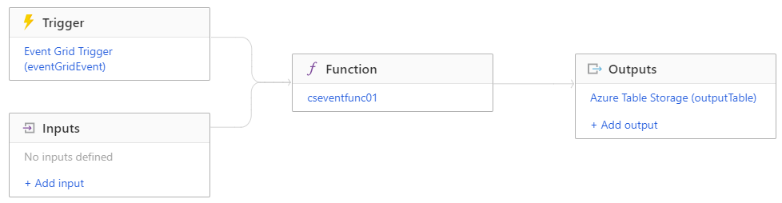

## Introduction

Continuing with Matt Allford's ([@mattallford](https://twitter.com/mattallford)) CloudSkill's course [Azure Functions for DevOps Engineers](https://portal.cloudskills.io/azure-functions-powershell), I looked into function triggers, bindings, and 

## Prerequisite

- Azure Subscription
- PowerShell knowledge

## Use Case

- Take input from a trigger and use it in the function
- Output data to other resources 

## Try yourself

The next section of the course goes through how to take data from the trigger for the function and use it in the function. All functions have a trigger, whether it's an HTTP trigger, a timer, or an event that happens elsewhere in Azure.

In this example, we built a trigger based on an event grid event, such as deleting a resource group. Every action in Azure creates an event in event grid, so we can easily key of these actions for our function to trigger.

For the function, the incoming data from the event grid is defined as a parameter named $eventGridEvent:

```powershell
param($eventGridEvent, $TriggerMetadata)
```

Once we know the event occurred (in this case, deleting a resource group), you can manipulate the data from the event and do something with it, like so:

```powershell
# Gather data from the function trigger paylod
$EventSubject = $eventGridEvent.subject -split "/"
$ResourceGroupName = $EventSubject[-1]
$user = $eventGridEvent.data.claims.'http://schemas.xmlsoap.org/ws/2005/05/identity/claims/upn'
$SubscriptionID = $eventGridEvent.data.subscriptionId

# Collect data from the event ready to send to Azure Table Storage
$TableData = [PSCustomObject]@{
    partitionKey = $eventGridEvent.eventTime
    rowkey = $eventGridEvent.id
    ResourceGroupName = $ResourceGroupName
    User = $user
}
```

We can then output the data into another Azure resource. For this example, we created an output binding named **outputTable** to store the event data into an Azure Table Storage. What's great is within the PowerShell code you don't need to know a lot of specifics for how to put this data into the table. You can use the **Push-OutputBinding** cmdlet with the name of the binding to put the data into the table:

```powershell
Push-OutputBinding -Name outputTable -Value $TableData
```

This will create the table if it doesn't exist and store the **$TableData** there.

Here's what the full integration map looks like:



## Next Steps

Continuing to the next lesson that covers various settings within the function app including storing environmental variables, keys, managed identities, and networking.

## Social Proof

[Twitter](https://twitter.com/JeffWBrown/status/1339010005081591808?s=20)
[LinkedIn](https://www.linkedin.com/posts/jeffwaynebrown_jeffbrowntech100daysofcloud-activity-6744775844713127936-xhjV)
