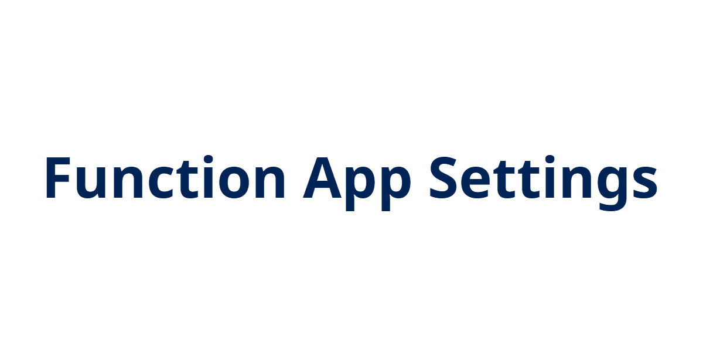

## Introduction

Continuing with Matt Allford's ([@mattallford](https://twitter.com/mattallford)) CloudSkill's course [Azure Functions for DevOps Engineers](https://portal.cloudskills.io/azure-functions-powershell), this next module covered a lot of topics like authentication, function keys, custom domains, managed identities, integrating key vault, and networking.

## Prerequisite

- Azure Subscription

## Try yourself

This next module in the course covered a lot of settings to use within Azure Functions. Here's a quick highlight of a few of them.

### Authentication
You can authenticate users against different providers, such as Azure Active Directory, Microsoft, Facebook, Google, Twitter, etc. The Azure Function will manages any refresh tokens and the authenticated session.

### Function Keys
Function keys make it harder to access the function app. HTTP access can be anonymous or require a API key in the request. There are two authorization levels for API keys:

1. Function - only applies to the function where the key is defined
2. Host - access any function within the function app

There is also a Master Key at the admin level for accessing the Function Runtime API. This key cannot be deleted or renewed.

When creating a new function inside the function, you'll have three options: Function, Anonymous, or Admin.

### Application Settings
In the Function App, you can configure settings to be used within the app. You can define variables to be used in the function code, such as a storage account endpoint or a Key Vault reference. The Key Vault could contain a user name or password secret for authenticating to a service. The ability to reference a Key Vault value protects any sensitive information that you might need to pass to the code in the function. The values stored here can be referenced inside the code as an environment variable. In PowerShell, this would look like *$env:<name of app setting>*.

### Managed Identities
Managed identities are not unique to Azure Functions, and they enable an identity to be associated with a resource. You can then use this identity to allow the Function App access to other Azure AD Resources. The two types are:

1. System-assigned: tied to the Function App and is deleted if the function app is deleted
2. User-assigned: standalone identity resource that is not tied to the function app; can be assigned to multiple resources

An example includes creating a managed identity for a Function App, then assigning that identity an access policy to retrieve items in an Azure Key Vault. With the identity, you can scope the Azure Function to only have the permissions it needs to perform the actions required, such as listing and retrieving secrets while not creating or deleting.

### Networking

Azure Functions are pretty flexible when it comes to networking. You can use Azure Front Door to have a primary and secondary regions for a function to execute. You can also create hybrid connections so the function can access resources outside of Azure. You can create a subnet in a vnet so the function can access resources inside the vnet, or even create a private endpoint for the function so resources can access the function without traversing the public Internet.

## Next Steps

The next module in the course is covering monitoring.

## Social Proof

[Twitter](https://twitter.com/JeffWBrown/status/1340853470803316736?s=20)

[LinkedIn](https://www.linkedin.com/posts/jeffwaynebrown_jeffbrowntech100daysofcloud-activity-6746619455578759169-18dI)