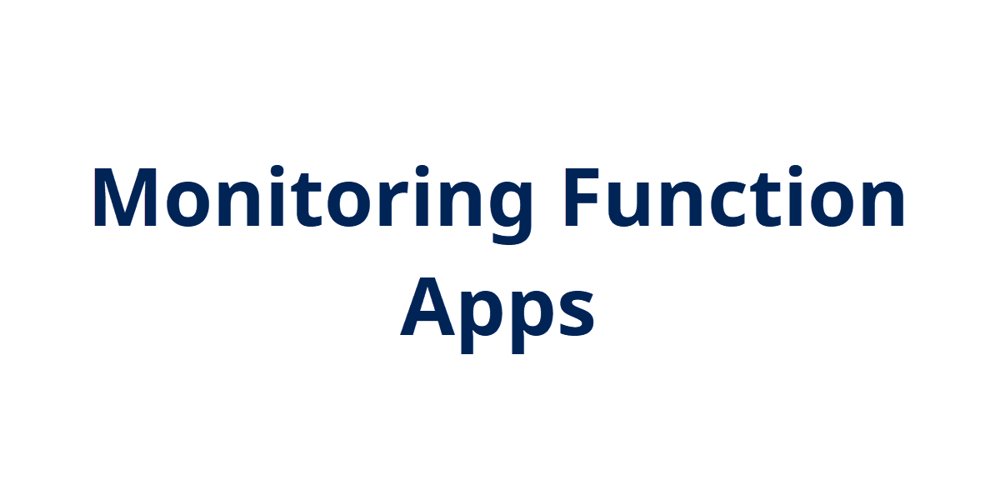
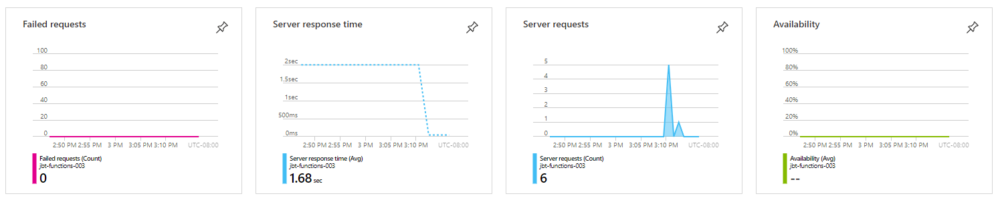
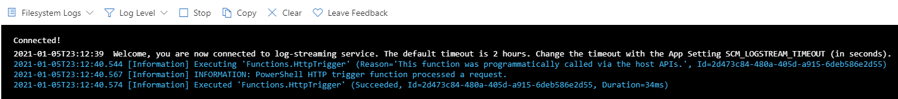
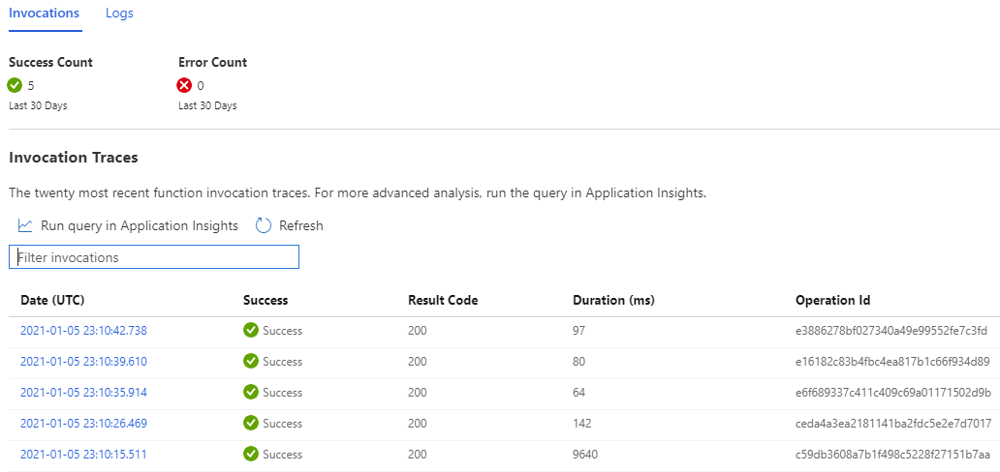
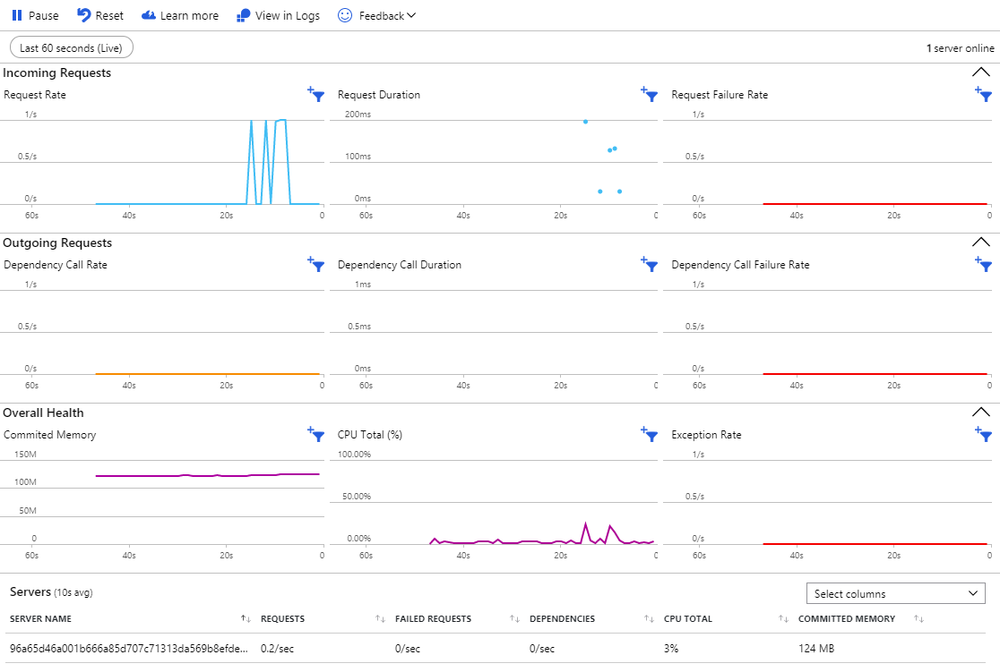

## Introduction

Following up in the function app course, we're taking a look at monitoring function apps.

## Prerequisite

- Azure Subscription
- Function App to execute

## Use Case

The ability to monitor and troubleshoot any resource or application is paramount to its successful usage.

## Try yourself

Monitoring the performance of functions and troubleshoot them when they are not working is crucial. Microsoft provides several resources to monitor your Functions.

- Application Insights & Metrics
    - Can be configured when creating the function app or later.
    - Can view Function's Settings > Configuration for App Insights connection information
    - Overview provides information like failed requests, response time, availability

- Function Logs
    - View the output of the function app running when it is executed

- Monitor
    - View the last 20 invocations of a specific function and their results

- Live Metrics
    - Part of Application Insights
    - Provides more granular and real-time metrics

- Diagnostic Settings
    - Configure Function logs or metrics to export this information to Log Analytics, storage account, or stream to event hub
- Alerts
    - Configure alerts based on certain triggers
    - Create action group to send emails or integrate with another platform (e.g. ServiceNow)

## Next Steps

Coming up next is the last module in the course. Will be covering development and integration with CI/CD pipelines in Azure DevOps.

## Social Proof

[Twitter](https://twitter.com/JeffWBrown/status/1346600171216388096?s=20)
[LinkedIn](https://www.linkedin.com/posts/jeffwaynebrown_jeffbrowntech100daysofcloud-activity-6752366067156434944-GPfF)
