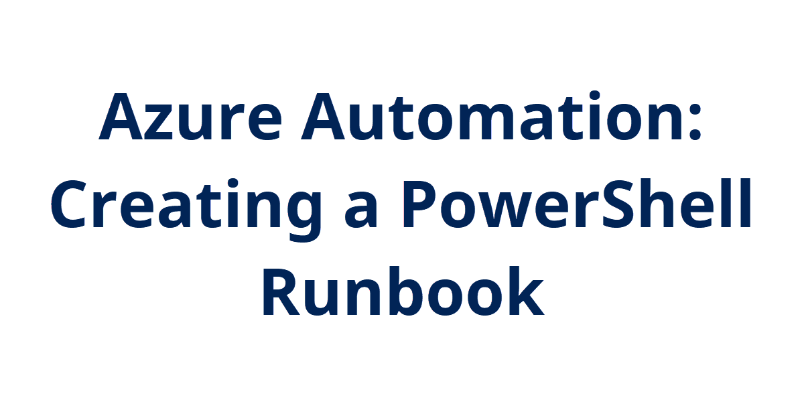

## Introduction

Azure Automation is a tool for automation and configuration of Azure resources. You can author runbooks in PowerShell or Python to manage and interact with your Azure tenant. In this first day, I'm going to cover how to create an Azure Automation Account and author your first PowerShell runbooks.

## Prerequisite

- Azure Subscription
- Some PowerShell knowledge

## Try yourself

Check out the full steps over at the CloudSkill.io blog where I outline how to get started:

[CloudSkills.io | Azure Automation: Creating a PowerShell Runbook](https://cloudskills.io/blog/azure-automation-runbook)

## Next Steps

Following up from this, I'll dive into more on authenticating to Azure from a runbook.
