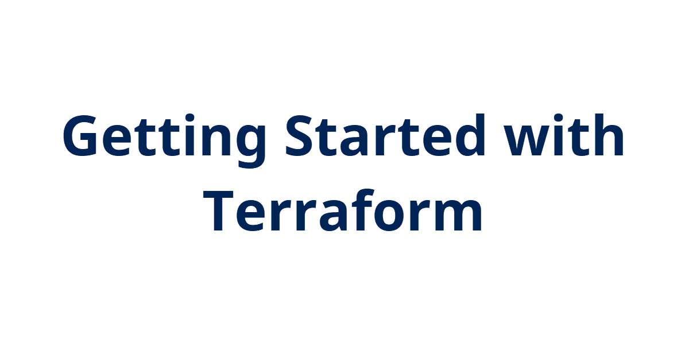

## Introduction

Diving back into some IaC concepts, I'm going to take a few days to look at Terraform. Terraform seems to be the popular tool for defining and deploying infrastructure. I'm going to learn some basics and then apply it to Azure.

## Use Case

Terraform is used to define infrastructure in an easy-to-read syntax for deployment and update purposes.

## Try yourself

I'm getting started by watching [CloudSkills.io](https://cloudskills.io) course called [Terraform on Azure: The Big Picture](https://cloudskills.io/courses/terraform-azure). This was a live, two-day course back in 2020 led by Mike Pfeiffer, Luke Orellana, and Michael Levan. It has 12 modules in it, I'll document a few at a time in this posts.

There are several options for writing and executing Terraform code. To get started, I'm just using the Azure Cloud Shell, which has Terraform built-in and is already authenticated to Azure. You can also download the Terraform executable and place it in a folder that's in your PATH environment. This allows running Terraform commands in any directory from the console.

To verify if Terraform is available, run the version command to output the current version:

```
terraform version
```


## Next Steps

✍️ Describe what you think you think you want to do next.

## Social Proof

✍️ Show that you shared your process on Twitter or LinkedIn

[link](link)
