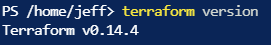

# Configurations

## Introduction

Diving back into some IaC concepts, I'm going to take a few days to look at Terraform. Terraform seems to be the popular tool for defining and deploying infrastructure. I'm going to learn some basics and then apply it to Azure.

## Use Case

Terraform is used to define infrastructure in an easy-to-read syntax for deployment and update purposes.

## Try yourself

I'm getting started by watching [CloudSkills.io](https://cloudskills.io) course called [Terraform on Azure: Infrastructure as Code from Scratch](https://cloudskills.io/courses/terraform-azure). Luke Orellana is the course author.

There are several options for writing and executing Terraform code. To get started, I'm just using the Azure Cloud Shell, which has Terraform built-in and is already authenticated to Azure. You can also download the Terraform executable and place it in a folder that's in your PATH environment. This allows running Terraform commands in any directory from the console.

To verify if Terraform is available, run the version command to output the current version:

```
terraform version
```



Terraform code is written to a main.tf file. I find the syntax very easy to follow. Much better that ARM template's JSON and similar to Ansible. Here's an example of creating a resource group and virtual network:

```
#create resource group
resource "azurerm_resource_group" "rg" {
    name     = "rg-terrformchallenge"
    location = "westus2"
    tags      = {
      Environment = "terraexample"
    }
}

#Create virtual network
resource "azurerm_virtual_network" "vnet" {
    name                = "vnet-dev-westus2-001"
    address_space       = ["10.1.0.0/16"]
    location            = azurerm_resource_group.rg.location
    resource_group_name = azurerm_resource_group.rg.name
}
```

Terraform command syntax is pretty straight forward:

- init : Initalizes the back end and downloads the provider plugins, like the azurerm provider to work with Azure resources
- plan : a "what it" command, shows the changes that will occur.
- apply : deploys the resources specified in the main.tf file
- destroy : removes the resources in the main.tf file. I like this command, especially with cloud resources so you can quickly spin up, then 'destroy' them to avoid consumption charges.

The last section talks about interpolation, which is where you pass information between resources. For example, "rg" is the name of the resource group block above. I then reference the resource group created in the virtual network "location" and "resource_group_name" sections.

Finally, Terraform is smart enough to know which order resources need to be deployed in. This is very different than ARM templates where you use "dependsOn". Since I reference the resource group in the virtual network creation, Terraform knows to create the resource group first before the virtual network.

Check out my answer to the [end-of-module challenge](https://github.com/JeffBrownTech/terraform_learning/tree/main/cloudskills_terraform-on-azure/02-Configurations).

## Next Steps

Will work on next module over Terraform state.